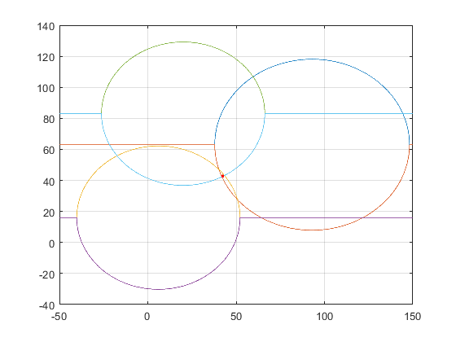

# Task 1
## a)
### Write the Gauss-Newton iteration, why do we use Gauss-Newton & not Newtons method?

```matlab
%Define the system of equations with v = (xp,yp) & moved R.H.S to solve ekv(v) = 0
ekv = @(v) [(93-v(1))^2 + (63 - v(2))^2 - 55.1^2 ; (6-v(1))^2 + (16 - v(2))^2 - 46.2^2; (20-v(1))^2+(83-v(2))^2-46.2^2];

%Method uses the Jacobian matrix to ekv(v):
J = @(v) -2*[93-v(1), 63-v(2); 6-v(1), 16-v(2);20-v(1), 83-v(2)];

%The iteration xn+1 = 
theta = @(v) v + J(v)\-ekv(v); 
```
It is Gauss-Newton as the SoE now has three equations and two unknowns,
which means it will only have an approximate solution (Found through
Gauss-Newton) in the Least-Squares sense.

## b)
### Run Gauss-Newton with the answer from Labb1 as start guess:
```matlab
guesses = [40.283656605002214,50.694601730035630;46.968869688612920,27.697545733763840];

%see fixpunkt.m for details
results = unique(fixpunkt(guesses, theta, 1e-14));
```

## c)
###  Plot the circles and their solutions, are they at the intersections? What is expected?
The circles do not intersect the point but that is because there is no perfect point where all circles cross, the Gauss-Newton function only attempts to minimize the mean square error to find the best possible point: `(42.4134 42.8719)` having a low error: `||ekv(v)||2 = 1.310642e+04`.


```matlab
 Finding root at: [4.028366e+01,4.696887e+01,] 
S = NaN 
 Iter: 1 v: [4.235064e+01,4.295853e+01,] diff: 4.511675e+00 
S = 2.276384e-02 
 Iter: 2 v: [4.241118e+01,4.287557e+01,] diff: 1.027031e-01 
S = 3.995963e-02 
 Iter: 3 v: [4.241330e+01,4.287206e+01,] diff: 4.103976e-03 
S = 4.099334e-02 
 Iter: 4 v: [4.241338e+01,4.287191e+01,] diff: 1.682357e-04 
S = 4.110149e-02 
 Iter: 5 v: [4.241338e+01,4.287190e+01,] diff: 6.914736e-06 
S = 4.111872e-02 
 Iter: 6 v: [4.241338e+01,4.287190e+01,] diff: 2.843251e-07 
S = 4.112193e-02 
 Iter: 7 v: [4.241338e+01,4.287190e+01,] diff: 1.169200e-08 
S = 4.112213e-02 
 Iter: 8 v: [4.241338e+01,4.287190e+01,] diff: 4.807999e-10 
S = 4.112829e-02 
 Iter: 9 v: [4.241338e+01,4.287190e+01,] diff: 1.977448e-11 
S = 4.097702e-02 
 Iter: 10 v: [4.241338e+01,4.287190e+01,] diff: 8.102991e-13 
S = 4.722194e-02 
 Iter: 11 v: [4.241338e+01,4.287190e+01,] diff: 3.826390e-14 
S = 0 
 Iter: 12 v: [4.241338e+01,4.287190e+01,] diff: 0 
```

# Task 2
## a)
### Plot the integrand & calculate it algebraically
```matlab
ekv = @(v) sqrt(v+2);
% EKV(v) is the primitive function of ekv.
EKV(v) = [(2/3)*(v+2)^(3/2)] => I = [EKV(1)- EKV(-1)] = 2*sqrt(3)-(2/3) ~= 2.797
```

## b)
### Approximate I using the Trapezoidal rule for h = 1, 0.5, 0.25, 0.125, 0.0625
yes the approximations seem to converge as h->0


## c)
### Calculate the error for each approximation. What does theory say? What's expected? Is that right?
```matlab
Trapezoid using h = 1 
Trapezoid using h = 5.000000e-01 
Trapezoid using h = 2.500000e-01 
Trapezoid using h = 1.250000e-01 
Trapezoid using h = 6.250000e-02 

results =      2.7802       2.7931       2.7963       2.7972       2.7974


errors =  0.017196    0.0043736    0.0010988   0.00027504   6.8783e-05

%The quota error(n-1)/error(n)
change_err =   0       3.9318       3.9805       3.9949       3.9987
```

Theory tells us that the trapezoidal rule has a Order of accuracy of 2 meaning the Error from using step-length h is O(h^2), this in turn means that we should expect the error quota difference after halving step length to be O(h^2)/O((h/2)^2) ~= 4. This is seen with some slight variation, so theory holds!

## d)
### Now calculate I, using Simpsons method/ Richardson extrapolation, What about the errors there?
```matlab
%Using Richardson extrapolation we calucalte for h = 1,
%0.5,0.25,0.125,0.0625, knowing the Order of accuracy is 2 => 
%cp = 1/2^p-1 = 1/3;
R = @(h) T(h)-(T(2*h)-T(h))/3;
```

Using richardson extrapolation, theory tells us that the Order of Accuracy should increase by two p=2 -> p = 4. This would in turn mean that the error quota would be O(h^4)/O((h/2)^4) ~= 16. It seemingly takes a while before it reaches this zone of assymptotic convergence but it is close by the last two step-lengths

```matlab
r_results = 2.7963       2.7973       2.7974       2.7974       2.7974

r_errors =  0.0011333   9.9492e-05   7.1574e-06   4.6809e-07   2.9623e-08

r_change_err =  0        11.39       13.901       15.291       15.802
```

## e)
### Plot the errors of both mehods using loglog


There too we see a slope of approximatly 2 for trapezoid & 4 for Richardsons extrapolated trapezoid (Simpsons) as according to theory

# Task 3 
## a)
### Trapezoidal rule
```matlab
Denominator: 1.7640408807911219e+00 with h: 1.000000e-01
Denominator: 1.7641615605026015e+00 with h: 1.000000e-02
Denominator: 1.7641627693144204e+00 with h: 1.000000e-03
Denominator: 1.7641627814027387e+00 with h: 1.000000e-04
Denominator: 1.7641627815236232e+00 with h: 1.000000e-05
Denominator: 1.7641627815248302e+00 with h: 1.000000e-06
Denominator: 1.7641627815248437e+00 with h: 1.000000e-07
Denominator: 1.7641627815248337e+00 with h: 1.000000e-08
Denominator: 1.7641627815248191e+00 with h: 5.000000e-09
```

## b)
Numerator calulated with h = 0.1
```matlab
Numerator trapezoid: 1.8548609949828369e+04 with h: 1.000000e-01 time: 7.733632e+01s
m = 1.051411e+04 
```
Numerator calulated with h = 0.05
```matlab
Numerator trapezoid: 1.8549570984977028e+04 with h: 5.000000e-02 time: 1.480041e+02s
m = 1.051466e+04
```

```matlab
differance in m = 5.447542e-01
differance in numerator = 9.610351e-01
```

4 correct decimals


## c)
Numerator calculated with Simpsons rule
```matlab
Numerator simpson: 1.8549883302455717e+04 with h: 1.000000e-01 time: 5.441670e+01s
m = 1.051484e+04 with h = 1.000000e-01
```
```matlab
Numerator simpson: 1.8549891330026570e+04 with h: 5.000000e-02 time: 9.537896e+01s
m = 1.051484e+04 with h = 5.000000e-02
```

```matlab
differance in m = 4.550357220068690e-03
differance in numerator = 8.027571e-03
```
6 correct decimals
